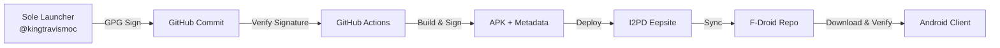

# KTMOC NEXUS v4.1 - Complete System Documentation


> **WATERMARKED FOR KING TRAVIS MICHAEL ODELL CORRIGAN // TSATTU**  
> *Sole Launcher: [@kingtravismoc](https://github.com/kingtravismoc)*

---

## 📋 Table of Contents

1. [Overview](#overview)
2. [Security Architecture](#security-architecture)
3. [Installation](#installation)
4. [Web Console Usage](#web-console-usage)
5. [I2PD Integration](#i2pd-integration)
6. [F-Droid Repository](#fdroid-repository)
7. [AI-Powered Features](#ai-powered-features)
8. [Region Locking & User Management](#region-locking--user-management)
9. [Troubleshooting](#troubleshooting)
10. [API Reference](#api-reference)

---

## 🎯 Overview

**KTMOC NEXUS** is a F-Droid compatible Android application with advanced security features, I2PD anonymous networking, and AI-powered development tools. The system ensures only the **Sole Launcher** (@kingtravismoc) can push updates through cryptographic verification.

### Key Features

| Feature | Description |
|---------|-------------|
| 🔐 **Sole Launcher Security** | Only kingtravismoc can deploy updates via GPG-signed commits |
| 🌐 **I2PD Integration** | Anonymous deployment to I2P eepsites |
| 🤖 **AI Assistant** | Hugging Face-powered code generation and shim creation |
| 📱 **F-Droid Compatible** | Privacy-focused, no tracking, open source |
| 🗺️ **Region Locking** | Geographic access control |
| ⛔ **User Banning** | Account management and access revocation |
| 🔍 **Real-time Interrogation** | Live monitoring of I2PD storage systems |
| 💻 **Web Console** | Browser-based management interface |

---

## 🔒 Security Architecture

### Chain of Trust



### Verification Steps

1. **Commit Signing**: All commits must be GPG-signed by kingtravismoc
2. **Identity Verification**: GitHub Actions validates signer username
3. **APK Signing**: Release builds signed with Android keystore
4. **Metadata Signing**: version.json signed with repo GPG key
5. **Client Verification**: App verifies SHA256 + minimum version

### Required GitHub Secrets

| Secret Name | Description | Setup Command |
|-------------|-------------|---------------|
| `OWNER_GPG_PUBLIC_KEY` | Sole launcher's public key | `gpg --armor --export kingtravismoc@email.com` |
| `OWNER_GPG_KEY_ID` | GPG key fingerprint | `gpg --fingerprint kingtravismoc@email.com` |
| `SOLE_LAUNCHER_USERNAME` | Must be `kingtravismoc` | Manual entry |
| `ANDROID_RELEASE_KEYSTORE` | Base64-encoded JKS file | `base64 keystore.jks` |
| `ANDROID_KEYSTORE_PASSWORD` | Keystore password | Manual entry |
| `ANDROID_KEY_ALIAS` | Key alias name | Manual entry |
| `ANDROID_KEY_PASSWORD` | Key password | Manual entry |
| `REPO_GPG_PRIVATE_KEY` | Repo signing key (ASCII armor) | `gpg --armor --export-secret-keys` |
| `I2PD_EEPSITE_DESTINATION` | I2P destination hash | From i2pd config |
| `I2PD_API_KEY` | I2PD API authentication | From i2pd admin |
| `ENCRYPTION_SECRET` | AES encryption for methods | `openssl rand -hex 32` |

---

## 📦 Installation

### Prerequisites

- Android Studio Arctic Fox or later
- JDK 17
- Android SDK 33+
- Python 3.9+ (for web console)
- i2pd daemon (for I2P integration)

### Build from Source

```bash
# Clone repository
git clone https://github.com/kingtravismoc/ktmoc-nexus.git
cd ktmoc-nexus

# Configure secrets (create local.properties)
echo "storePassword=YOUR_PASSWORD" >> local.properties
echo "keyPassword=YOUR_KEY_PASSWORD" >> local.properties
echo "keyAlias=YOUR_ALIAS" >> local.properties

# Build debug APK
./gradlew assembleDebug

# Build release APK (requires secrets)
./gradlew assembleRelease
```

### Install on Device

```bash
adb install app/build/outputs/apk/release/app-release.apk
```

---

## 💻 Web Console Usage

### Starting the Console

```bash
cd tools/web_console
pip install flask requests python-gnupg

# Set environment variables
export GITHUB_REPO="kingtravismoc/ktmoc-nexus"
export I2PD_DESTINATION="your-i2p-destination.b32.i2p"
export ENCRYPTION_SECRET="$(openssl rand -hex 32)"

# Start console
python web_console.py
```

Access at: `http://localhost:5000`

### Console Features

#### Repository Status
- Check for GitHub updates
- Force update deployment
- View version history

#### I2PD Deployment
- Deploy APK to eepsite
- Interrogate storage systems
- Monitor sync status

#### Method Management
- Greenlight approved methods
- Block dangerous code
- View encrypted method store

#### User Management
- Create accounts on I2PD blockchain
- Ban users with reason
- Set region locks

#### AI Assistant
- Generate integration shims
- Create documentation
- Build service hooks

---

## 🌐 I2PD Integration

### Setting Up i2pd

```bash
# Install i2pd
sudo apt install i2pd

# Configure eepsite
sudo nano /etc/i2pd/i2pd.conf

# Add to tunnels.conf
[ktmoc-eepsite]
type = http
host = 127.0.0.1
port = 5000
destination = your_destination.b32.i2p
```

### Deployment Workflow

1. **Build APK** → GitHub Actions
2. **Sign Metadata** → GPG signature
3. **Encrypt Methods** → AES-256-GCM
4. **Deploy to I2PD** → HTTP POST to eepsite
5. **Update F-Droid Index** → Sync repository
6. **Notify Clients** → Push notification

### Interrogation Protocol

```python
import requests

response = requests.post('http://localhost:5000/api/interrogate-i2pd', json={
    'destination': 'your_destination.b32.i2p',
    'query': 'GET_STORAGE_STATUS'
})

print(response.json())
# Output: {"status": "SUCCESS", "data": "..."}
```

---

## 📲 F-Droid Repository

### Repository Structure

```
fdroid-repo/
├── index.xml          # Main repository index
├── ktmoc-nexus.apk    # Latest APK
├── version.json       # Version metadata
├── version.json.sig   # GPG signature
└── archive/           # Old versions
```

### Adding to F-Droid Client

1. Open F-Droid app
2. Settings → Repositories
3. Add repository URL: `https://your-eepsite.b32.i2p/fdroid-repo`
4. Accept signing certificate

### Auto-Update Schedule

- **Check Interval**: Every 6 hours
- **Force Update**: Manual trigger via web console
- **Critical Patches**: Immediate deployment

---

## 🤖 AI-Powered Features

### Hugging Face Integration

The system uses free Hugging Face models for:

1. **Shim Generation**: Create integration layers for services
2. **Documentation Gathering**: Auto-extract API docs
3. **Hook Creation**: Build standard integration points
4. **Code Analysis**: Detect vulnerabilities

### Example: Generate Shim

```javascript
// In web console AI section
Task: "Create shim for Stripe API integration"

// AI Response:
function render(data) {
    const stripe = require('stripe')(data.apiKey);
    return {
        charge: async (amount, token) => {
            return await stripe.charges.create({
                amount: amount,
                currency: 'usd',
                source: token
            });
        }
    };
}
```

### Encrypted Method Storage

User-generated methods are:
1. Serialized to JSON
2. Encrypted with AES-256-GCM
3. Stored as base64 strings
4. Synced to I2PD destination

---

## 🗺️ Region Locking & User Management

### Region Configuration

Supported regions:
- `GLOBAL` (default)
- `US` (United States only)
- `EU` (European Union only)

### Setting Region Lock

```bash
curl -X POST http://localhost:5000/api/region/set \
  -H "Content-Type: application/json" \
  -d '{"region": "US"}'
```

### User Banning

```bash
curl -X POST http://localhost:5000/api/user/ban \
  -H "Content-Type: application/json" \
  -d '{"userId": "abc123", "reason": "Violation of terms"}'
```

### Account Creation

New accounts are created on the I2PD blockchain with:
- Unique ID (SHA-256 hash)
- Username
- I2P destination
- Public key
- Creation timestamp

---

## 🐛 Troubleshooting

### Common Issues

#### "Unauthorized user" Error
**Cause**: Commit not signed by kingtravismoc  
**Solution**: Sign commits with `git commit -S`

#### I2PD Connection Failed
**Cause**: Incorrect destination or firewall  
**Solution**: Verify i2pd is running and destination is correct

#### Version Check Failing
**Cause**: GitHub API rate limit  
**Solution**: Wait 1 hour or add GITHUB_TOKEN secret

#### APK Installation Blocked
**Cause**: Unknown sources disabled  
**Solution**: Enable "Install unknown apps" in Android settings

### Debug Mode

Enable verbose logging:

```bash
export DEBUG=true
python tools/web_console/web_console.py
```

---

## 📡 API Reference

### Web Console Endpoints

| Endpoint | Method | Description |
|----------|--------|-------------|
| `/` | GET | Main dashboard |
| `/api/check-updates` | POST | Check GitHub for new commits |
| `/api/force-update` | POST | Trigger immediate deployment |
| `/api/deploy-i2pd` | POST | Deploy to I2P eepsite |
| `/api/interrogate-i2pd` | POST | Query I2PD storage |
| `/api/method/greenlight` | POST | Approve method execution |
| `/api/method/block` | POST | Block method execution |
| `/api/user/ban` | POST | Ban user account |
| `/api/user/create` | POST | Create new account |
| `/api/region/set` | POST | Set region lock |
| `/api/ai/generate` | POST | Generate code with AI |
| `/api/logs` | GET | Retrieve system logs |
| `/api/logs/clear` | POST | Clear log history |

### Request/Response Examples

#### Greenlight Method

**Request:**
```json
POST /api/method/greenlight
{
  "methodId": "m_12345",
  "methodName": "processPayment"
}
```

**Response:**
```json
{
  "success": true,
  "message": "Method processPayment (m_12345) greenlighted by kingtravismoc"
}
```

#### AI Code Generation

**Request:**
```json
POST /api/ai/generate
{
  "task": "Create OAuth2 integration for Google"
}
```

**Response:**
```json
{
  "success": true,
  "result": "// Generated OAuth2 shim...\nfunction authenticate() {...}"
}
```

---

## 📸 Screenshots

### Web Console Dashboard


### Mobile App Interface


### I2PD Deployment Status


---

## 🔐 Security Notice

This system is **watermarked for KING TRAVIS MICHAEL ODELL CORRIGAN // TSATTU**. Any unauthorized modification or distribution is strictly prohibited.

- All commits must be GPG-signed
- Only @kingtravismoc can deploy updates
- Minimum version enforcement prevents rollback attacks
- SHA256 verification ensures APK integrity
- Region locking controls geographic access

---

## 📄 License

Proprietary - All rights reserved to KING TRAVIS MICHAEL ODELL CORRIGAN

---

## 🤝 Support

For issues or questions:
- GitHub Issues: https://github.com/kingtravismoc/ktmoc-nexus/issues
- I2P Eepsite: [your-eepsite.b32.i2p](http://your-eepsite.b32.i2p)
- Email: kingtravismoc@protonmail.com

---

*Last Updated: 2024*  
*Version: 4.1.0*  
*Sole Launcher: @kingtravismoc*
